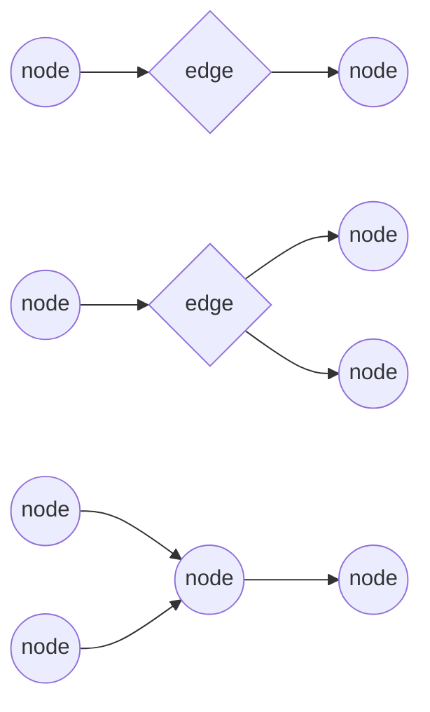

# xo-tasktree


**xo-tasktree** is a .NET 8 library for building composable, type-safe, and testable task workflows using a fluent, functional-style API. It enables advanced branching, argument matching, and workflow orchestration for complex business logic.

---

## Features
- Fluent API for workflow and branching logic
- Type-safe node and edge composition
- Supports conditional, hash, path, and parallel branching
- Extensible with custom functions and argument resolvers
- Integrates with Microsoft.Extensions.DependencyInjection & Logging

---

## Installation

Add the package to your project (when available on NuGet):

```sh
dotnet add package Xo.TaskTree
```

---

## Getting Started

1. **Register services** in your DI container:
    ```csharp
    services.AddTaskTree();
    ```

2. **Inject** `IStateManager` to build workflows using the TaskTree's fluent API.

3. **Resolve** your workflow asynchronously:
    ```csharp
    var result = await workflow.Resolve(cancellationToken);
    ```

---

## Usage Examples

### If-Else Branching
```csharp
var mn = _stateManager
    .RootIf<IY_OutConstBool_SyncService>()
    .Then<IY_InStr_OutConstInt_AsyncService>(
        configure => configure.MatchArg("<<arg-1>>"),
        then => then.Then<IY_InInt_OutBool_SyncService>(c => c.RequireResult())
    )
    .Else<IY_InStr_AsyncService>(c => c.MatchArg<IY_InStr_OutConstStr_AsyncService>(c => c.MatchArg("<<arg-2>>")));
var n = mn.Build();
var msgs = await n.Resolve(cancellationToken);
```

### Null Check Branch
```csharp
var mn = _stateManager
    .IsNotNull<IY_OutObj_SyncService>()
    .Then<IY_InObj_OutConstInt_AsyncService>(c => c.RequireResult())
    .Else<IY_InStr_AsyncService>(c => c.AddArg("<<args>>", "args3"));
var n = mn.Build();
var msgs = await n.Resolve(cancellationToken);
```

### Argument Matching
```csharp
var mn = _stateManager
    .Root<IY_InBoolStr_OutConstInt_AsyncService>(c =>
        c.MatchArg<IY_OutConstBool_SyncService>()
         .MatchArg<IY_InBool_OutConstStrIfFalseElseDynamicStr_AsyncService>(c => c.MatchArg(true))
    );
var n = mn.Build();
var msgs = await n.Resolve(cancellationToken);
```

### Key/Hash Branching
```csharp
var mn = _stateManager
    .Root<IY_OutConstBool_SyncService>()
    .Key<IY_InBool_OutConstStr_AsyncService>(c => c.RequireResult())
    .Hash<IY_InBoolStr_OutConstInt_AsyncService, IY_AsyncService>(
        c => c.MatchArg(true).MatchArg("<<arg>>").Key("<<str>>"),
        c => c.Key("key-a"),
        then => then.Then<IY_InStr_OutConstInt_AsyncService>(c => c.MatchArg("<<arg>>"))
    );
var n = mn.Build();
var msgs = await n.Resolve(cancellationToken);
```

### Path Branching
```csharp
var mn = _stateManager
    .Root<IY_OutConstBool_SyncService>()
    .Path<IY_InBool_OutConstStr_AsyncService, IY_InStr_OutConstInt_AsyncService, IY_InInt_OutConstInt_AsyncService>(
        c => c.RequireResult(),
        c => c.RequireResult(),
        c => c.RequireResult()
    );
var n = mn.Build();
var msgs = await n.Resolve(cancellationToken);
```

## Laws
- A Node contains a single fn.
- Nodes do not directly reference other nodes, nodes reference edges. Edges reference nodes.
- There should be a single core node type. ie. no different type for a decision making node.

## Branching
### Branch Types



## Logic

### Decisions

$$
S : S(x) \rightarrow s
\\
f : f(S) \rightarrow f(S(x)) \rightarrow s
\\
$$