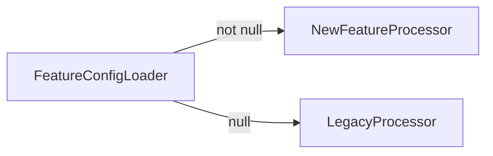
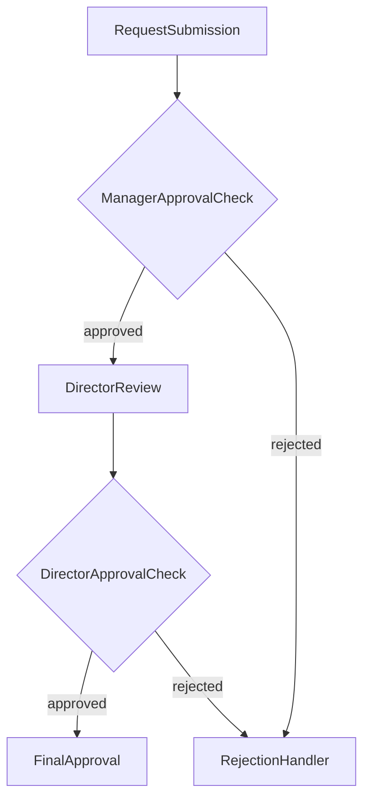
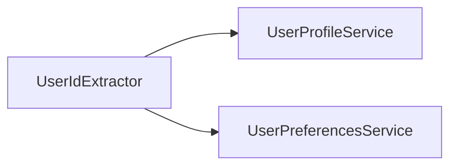

# xo-tasktree


Build AI-friendly, composable task workflows that generate better code by emphasizing declarative structure over imperative orchestration.

---

## Table of Contents

- [Overview](#overview)
- [Features](#features)
- [Installation](#installation)
- [Quick Start](#quick-start)
- [Core Concepts](#core-concepts)
- [Usage Examples](#usage-examples)
- [Performance Considerations](#performance-considerations)
- [Advanced Topics](#advanced-topics)
- [Contributing](#contributing)
- [License](#license)

---

## Overview

**xo-tasktree** is a .NET 8 library for building composable, type-safe, and testable task workflows using a fluent, functional-style API. By modeling workflows as declarative graphs rather than procedural orchestration, xo-tasktree makes it easier for AI coding agents to understand, generate, and modify complex business logic.

The library excels at workflow orchestration, request processing pipelines, and business logic composition. It integrates seamlessly with `Microsoft.Extensions.DependencyInjection` and `Microsoft.Extensions.Logging`, fitting naturally into modern .NET applications.

---

## Features

- **Fluent API** for workflow and branching logic
- **Type-safe** node and edge composition
- **Conditional, hash, path, and parallel branching** support
- **Extensible** with custom functions and argument resolvers
- **Integrates** with Microsoft.Extensions.DependencyInjection & Logging

---

## Installation

### Prerequisites

- .NET 8.0 SDK or later
- Basic familiarity with dependency injection patterns

### Install via NuGet

```sh
dotnet add package Xo.TaskTree
```

Or via Package Manager Console:

```powershell
Install-Package Xo.TaskTree
```

### Setup Dependency Injection

Register TaskTree services in your startup/program configuration:

```csharp
using Xo.TaskTree.DependencyInjection.Extensions;

services.AddTaskTreeServices();

// Register your business services
services.AddScoped<IDataValidator, DataValidator>();
services.AddScoped<IDataProcessor, DataProcessor>();
services.AddScoped<IErrorHandler, ErrorHandler>();
```

---

## Quick Start

Here's a simple workflow that validates and processes user input—a common pattern in AI-generated applications:

```csharp
public class ValidationWorkflow
{
    private readonly IStateManager _stateManager;

    public ValidationWorkflow(IStateManager stateManager)
    {
        _stateManager = stateManager;
    }

    public async Task<IReadOnlyList<IMsg>> ValidateAndProcessAsync(CancellationToken ct)
    {
        var workflow = _stateManager
            .Root<IInputValidator>()                      // Validate input
            .RootIf<IValidationResultChecker>()          // Check if valid
            .Then<IDataProcessor>(                        // Process if valid
                c => c.RequireResult()
            )
            .Else<IErrorHandler>();                       // Handle errors if invalid

        var node = workflow.Build();
        return await node.Resolve(ct);
    }
}
```

This creates a graph where data flows through validation, branching to either processing or error handling based on the validation result.

---

## Core Concepts

### Meta-State Workflow Building

When you use the fluent API to construct a workflow in xo-tasktree, you work in a **meta-state**. In this phase, your workflow is represented by meta abstractions (`IMetaNode`, `IMetaNodeEdge`) rather than concrete runtime objects.

- **Meta abstractions** capture the structure, configuration, and intent of your workflow as you compose it
- This allows for validation, transformation, and analysis before execution logic is created
- When you call `.Build()`, the meta workflow transforms into a concrete workflow ready for execution

**Example:**

```csharp
// Meta-state (fluent API)
var meta = _stateManager.RootIf<IMyService>().Then<IOtherService>();

// Concrete workflow (after build)
var node = meta.Build(); // node is an INode, ready for execution
```

This separation enables static analysis, flexible composition, and late binding with dependency injection.

### Branching Edge Types

Branching in xo-tasktree is modeled using three core edge types:

#### Monarius (Single Edge)

Represents a single outgoing edge from a node (linear flow).

```csharp
public interface IMonariusNodeEdge : INodeEdge {
    INode Edge { get; }
}
```

#### Binarius (Dual Edge)

Represents a binary branch, such as if/else or true/false logic.

```csharp
public interface IBinariusNodeEdge : INodeEdge {
    INode? Edge1 { get; }
    INode? Edge2 { get; }
}
```

#### Multus (Multi Edge)

Represents multiple outgoing edges (e.g., switch/case, hash, or parallel branches).

```csharp
public interface IMultusNodeEdge : INodeEdge {
    IList<INode> Edges { get; }
}
```

These edge types allow you to model any workflow branching scenario, from simple linear flows to complex decision trees and parallel execution paths.

### Node Controllers

A **node controller** determines whether a branch is executed, acting as a gatekeeper for conditional logic. The controller validates the output of a node and determines which branch to follow.

**Common controller types:**

- `True`: Proceeds if the condition is true
- `IsNotNull`: Proceeds if the value is not null
- `Equals`: Proceeds if the value equals a specified value

---

## Usage Examples

### Document Processing Pipeline

Linear workflow for processing documents through multiple stages:

```csharp
var workflow = _stateManager
    .Root<IDocumentParser>()
    .Path<IDataExtractor, ISchemaValidator, IDataRepository>(
        c => c.RequireResult(),
        c => c.RequireResult(),
        c => c.RequireResult()
    );

var node = workflow.Build();
var results = await node.Resolve(cancellationToken);
```


---

### Conditional Feature Flag Workflow

Branch execution based on feature flag configuration:

```csharp
var workflow = _stateManager
    .IsNotNull<IFeatureConfigLoader>()
    .Then<INewFeatureProcessor>(c => c.RequireResult())
    .Else<ILegacyProcessor>();

var node = workflow.Build();
var results = await node.Resolve(cancellationToken);
```



---

### Multi-Stage Approval Process

Nested conditionals for a multi-level approval chain:

```csharp
var workflow = _stateManager
    .Root<IRequestSubmission>()
    .RootIf<IManagerApprovalCheck>()
    .Then<IDirectorReview>(
        c => c.RequireResult(),
        then => then
            .RootIf<IDirectorApprovalCheck>()
            .Then<IFinalApproval>(c => c.RequireResult())
            .Else<IRejectionHandler>()
    )
    .Else<IRejectionHandler>();

var node = workflow.Build();
var results = await node.Resolve(cancellationToken);
```



---

### API Request Router

Hash-based routing by API version:

```csharp
var workflow = _stateManager
    .Root<IRequestParser>()
    .Key<IVersionExtractor>(c => c.RequireResult())
    .Hash<IV1Handler, IV2Handler, IV3Handler>(
        c => c.Key("v1"),
        c => c.Key("v2"),
        c => c.Key("v3")
    );

var node = workflow.Build();
var results = await node.Resolve(cancellationToken);
```

---

### Parallel Data Enrichment

Fetch data from multiple sources concurrently:

```csharp
var workflow = _stateManager
    .Root<IUserIdExtractor>()
    .Branch<IUserProfileService, IUserPreferencesService>(
        c => c.RequireResult(),
        c => c.RequireResult()
    );

var node = workflow.Build();
var results = await node.Resolve(cancellationToken);
```



---

## Performance Considerations

### Reflection Usage

**Important:** xo-tasktree uses reflection to dynamically resolve and invoke service methods. While this provides powerful flexibility and enables the fluent API, it has performance implications:

- **Not recommended for hot paths** - Avoid using in tight loops or high-frequency operations
- **Suitable for orchestration** - Well-suited for workflow orchestration, request processing pipelines, and business logic composition
- **Consider alternatives for performance-critical code** - For performance-sensitive scenarios, consider hand-coded implementations

### Best Practices

- Build workflows once and reuse them (don't rebuild on every execution)
- Use workflow context to share state efficiently
- Profile and benchmark your specific use cases
- See [benchmarks project](/test/benchmark/Xo.TaskTree.Benchmarks) for performance metrics

---

## Advanced Topics

For detailed documentation on advanced scenarios, see:

- [Low-Level API Guide](./coding-agent-prompt.md) - Manual node construction
- [Custom Functions](./coding-agent-prompt.md) - Extending BaseFn
- [Workflow Context](./coding-agent-prompt.md) - Sharing state across nodes
- [Error Handling](./coding-agent-prompt.md) - Exception handlers and retry logic

---

## Contributing

Contributions are welcome! Please feel free to:

- Report bugs via [GitHub Issues](https://github.com/stiproot/xo-tasktree/issues)
- Submit pull requests for bug fixes or features
- Improve documentation
- Share feedback and suggestions

---

## License

This project is licensed under the GNU General Public License v3.0 - see the [LICENSE](LICENSE) file for details.
