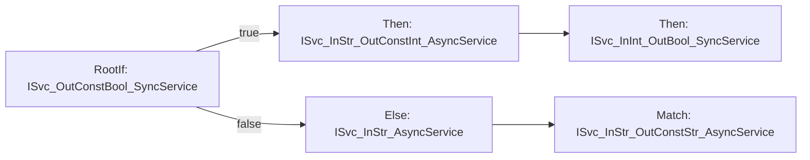
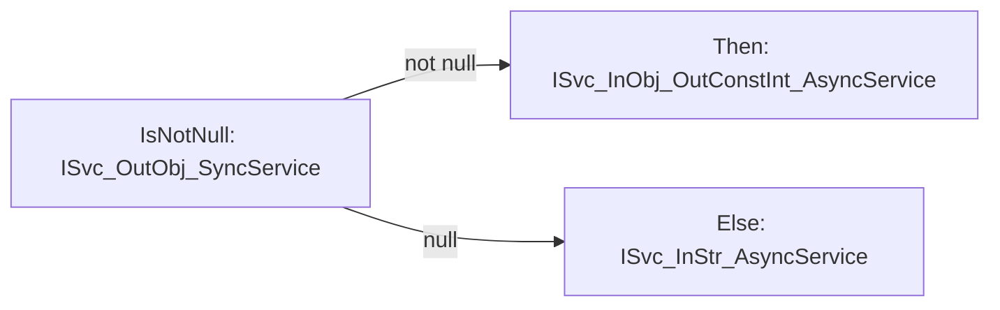
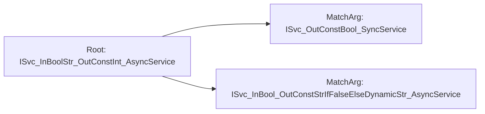
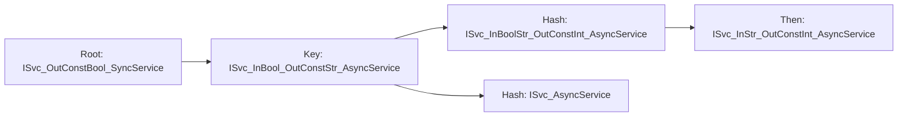
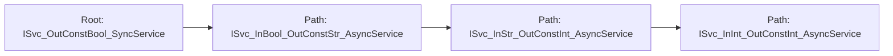
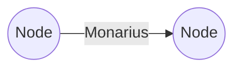
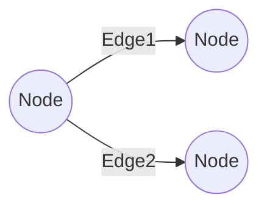
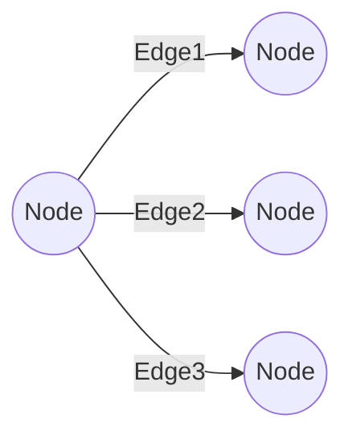
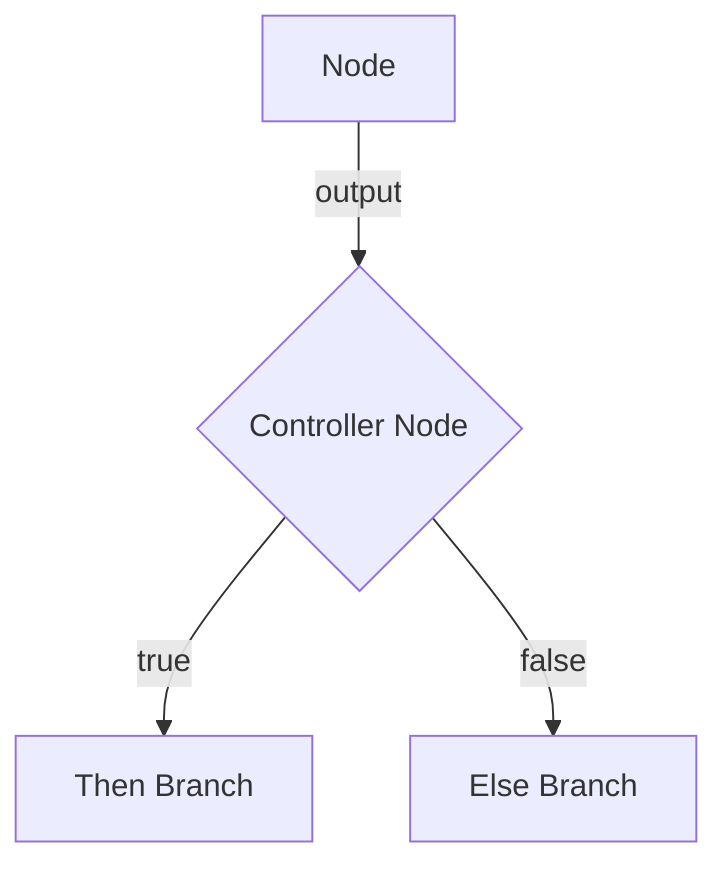

# xo-tasktree


**xo-tasktree** is a .NET 8 library for building composable, type-safe, and testable task workflows using a fluent, functional-style API. It enables advanced branching, argument matching, and workflow orchestration for complex business logic.

---

## Features
- Fluent API for workflow and branching logic
- Type-safe node and edge composition
- Supports conditional, hash, path, and parallel branching
- Extensible with custom functions and argument resolvers
- Integrates with Microsoft.Extensions.DependencyInjection & Logging

---

## Installation

Add the package to your project (when available on NuGet):

```sh
dotnet add package Xo.TaskTree
```

---

## Meta Module & Workflow Building

When you use the fluent API to construct a workflow in xo-tasktree, you are initially working in a **meta-state**. In this phase, your workflow is represented by meta abstractions—such as `IMetaNode`, `IMetaNodeEdge`, and related meta types—rather than concrete runtime objects.

- **Meta abstractions** (e.g., `IMetaNode`, `IMetaNodeEdge`) capture the structure, configuration, and intent of your workflow as you compose it.
- This meta-state allows for validation, transformation, and analysis before any actual execution logic is created.
- When you call `.Build()`, the meta workflow is transformed into a **concrete workflow**:
    - `IMetaNode` → `INode`
    - `IMetaNodeEdge` → `INodeEdge`
    - ...and so on

This separation enables powerful design-time features, such as:
- Static analysis and validation of workflow structure
- Flexible composition and reuse of workflow fragments
- Late binding and dependency injection

**Example:**
```csharp
// Meta-state (fluent API)
var meta = _stateManager.RootIf<IMyService>().Then<IOtherService>();

// Concrete workflow (after build)
var node = meta.Build(); // node is an INode, ready for execution
```

This design makes xo-tasktree both expressive and safe, supporting advanced scenarios in workflow authoring and execution.

---

## Usage Examples

### If-Else Branching



```csharp
var mn = _stateManager
    .RootIf<ISvc_OutConstBool_SyncService>()
    .Then<ISvc_InStr_OutConstInt_AsyncService>(
        configure => configure.MatchArg("<<arg-1>>"),
        then => then.Then<ISvc_InInt_OutBool_SyncService>(c => c.RequireResult())
    )
    .Else<ISvc_InStr_AsyncService>(c => c.MatchArg<ISvc_InStr_OutConstStr_AsyncService>(c => c.MatchArg("<<arg-2>>")));
var n = mn.Build();
var msgs = await n.Resolve(cancellationToken);
```

### Null Check Branch



```csharp
var mn = _stateManager
    .IsNotNull<ISvc_OutObj_SyncService>()
    .Then<ISvc_InObj_OutConstInt_AsyncService>(c => c.RequireResult())
    .Else<ISvc_InStr_AsyncService>(c => c.AddArg("<<args>>", "args3"));
var n = mn.Build();
var msgs = await n.Resolve(cancellationToken);
```

### Argument Matching



```csharp
var mn = _stateManager
    .Root<ISvc_InBoolStr_OutConstInt_AsyncService>(c =>
        c.MatchArg<ISvc_OutConstBool_SyncService>()
         .MatchArg<ISvc_InBool_OutConstStrIfFalseElseDynamicStr_AsyncService>(c => c.MatchArg(true))
    );
var n = mn.Build();
var msgs = await n.Resolve(cancellationToken);
```

### Key/Hash Branching



```csharp
var mn = _stateManager
    .Root<ISvc_OutConstBool_SyncService>()
    .Key<ISvc_InBool_OutConstStr_AsyncService>(c => c.RequireResult())
    .Hash<ISvc_InBoolStr_OutConstInt_AsyncService, ISvc_AsyncService>(
        c => c.MatchArg(true).MatchArg("<<arg>>").Key("<<str>>"),
        c => c.Key("key-a"),
        then => then.Then<ISvc_InStr_OutConstInt_AsyncService>(c => c.MatchArg("<<arg>>"))
    );
var n = mn.Build();
var msgs = await n.Resolve(cancellationToken);
```

### Path Branching



```csharp
var mn = _stateManager
    .Root<ISvc_OutConstBool_SyncService>()
    .Path<ISvc_InBool_OutConstStr_AsyncService, ISvc_InStr_OutConstInt_AsyncService, ISvc_InInt_OutConstInt_AsyncService>(
        c => c.RequireResult(),
        c => c.RequireResult(),
        c => c.RequireResult()
    );
var n = mn.Build();
var msgs = await n.Resolve(cancellationToken);
```

## Laws
- A Node contains a single fn.
- Nodes do not directly reference other nodes, nodes reference edges. Edges reference nodes.
- There should be a single core node type. ie. no different type for a decision making node.


## Branching
Branching in xo-tasktree is modeled using three core edge types, each representing a different branching structure in your workflow graph:

### Monarius (Single Edge)
Represents a single outgoing edge from a node (linear or simple flow).

**Interface:**
```csharp
public interface IMonariusNodeEdge : INodeEdge {
    INode Edge { get; }
}
```

**Diagram:**


---

### Binarius (Dual Edge)
Represents a binary (two-way) branch, such as if/else or true/false logic.

**Interface:**
```csharp
public interface IBinariusNodeEdge : INodeEdge {
    INode? Edge1 { get; }
    INode? Edge2 { get; }
}
```

**Diagram:**


---

### Multus (Multi Edge)
Represents a node with multiple outgoing edges (e.g., switch/case, hash, or parallel branches).

**Interface:**
```csharp
public interface IMultusNodeEdge : INodeEdge {
    IList<INode> Edges { get; }
}
```

**Diagram:**


---

These edge types allow you to model any workflow branching scenario, from simple linear flows to complex decision trees and parallel execution paths, all with type safety and composability.


## Node Controllers

A **node controller** determines whether a branch of the workflow tree is executed, acting as a gatekeeper for conditional logic. The controller type is set in the `NodeConfiguration` during workflow composition. When the workflow is built, the controller becomes a node whose core operation is to validate the output of a node (as `IArgs`) according to the controller type (e.g., `True`, `IsNotNull`, `Equals`).

**How it works:**
- The controller type is configured in the meta-state (via `NodeConfiguration.ControllerType`).
- On build, a controller node is inserted into the tree.
- This node evaluates the output of its predecessor and determines which branch (if any) to follow.

**Common controller types:**
- `True`: Proceeds if the condition is true.
- `IsNotNull`: Proceeds if the value is not null.
- `Equals`: Proceeds if the value equals a specified value.


**Diagram:**


This pattern enables expressive, type-safe conditional logic in your workflow graphs, with each controller node encapsulating a specific validation or decision.