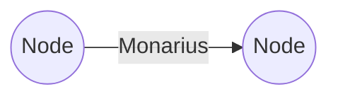
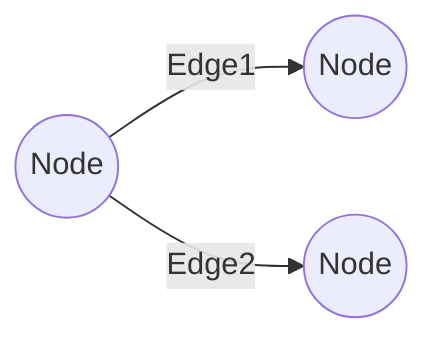
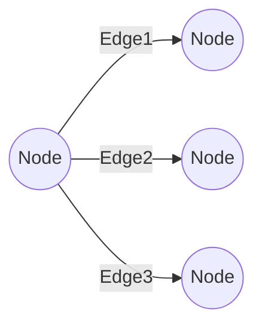
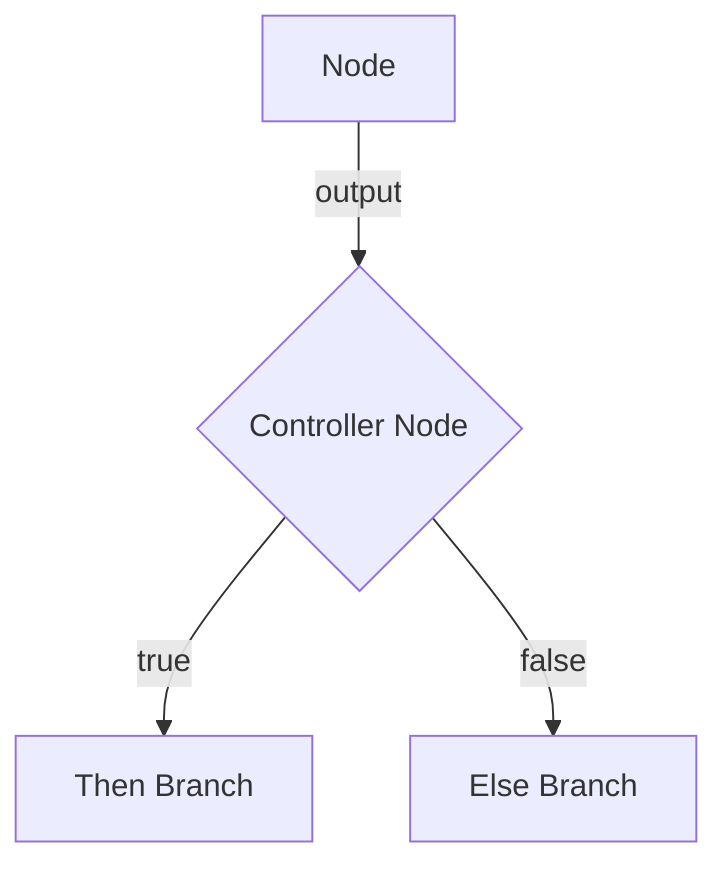

# Xo.TaskTree .NET Library - Coding Agent Guide

## Overview

Xo.TaskTree is a .NET 8 library for building composable, type-safe, and testable task workflows using a fluent, functional-style API. It enables advanced branching, argument matching, and workflow orchestration for complex business logic.


## Core Concepts

### Nodes and Edges
- **Node**: Encapsulates a single function (fn) and its configuration
- **Edge**: Connects nodes, enabling branching and flow
- **Workflow**: A connected graph of nodes representing your business logic

### 2. Key Interfaces and Components

#### Services and Functions
- **IFn**: Represents a function that can be executed (sync or async)
- **IFnFactory**: Creates function wrappers from service types and method names
- **BaseFn**: Base class for creating custom function implementations

#### Messages and Arguments
- **IMsg**: Encapsulates data passed between nodes
- **IMsgFactory**: Creates typed messages for data flow
- **IArgs**: Contains arguments/parameters for function execution

#### Node Building
- **INodeBuilder**: Fluent API for constructing individual nodes
- **INodeBuilderFactory**: Factory for creating node builders
- **INodeConfiguration**: Configuration for node behavior

#### Workflow Context
- **IWorkflowContext**: Shared state across the entire workflow
- **IWorkflowContextFactory**: Creates workflow contexts for state management

#### State Management (High-Level API)
- **IStateManager**: High-level fluent API for building complex workflows with branching logic


## Meta Module & Workflow Building

When you use the fluent API to construct a workflow, you are initially working in a **meta-state**. In this phase, your workflow is represented by meta abstractions—such as `IMetaNode`, `IMetaNodeEdge`, and related meta types—rather than concrete runtime objects.

- **Meta abstractions** (e.g., `IMetaNode`, `IMetaNodeEdge`) capture the structure, configuration, and intent of your workflow as you compose it.
- This meta-state allows for validation, transformation, and analysis before any actual execution logic is created.
- When you call `.Build()`, the meta workflow is transformed into a **concrete workflow**:
    - `IMetaNode` → `INode`
    - `IMetaNodeEdge` → `INodeEdge`
    - ...and so on

This separation enables powerful design-time features, such as:
- Static analysis and validation of workflow structure
- Flexible composition and reuse of workflow fragments
- Late binding and dependency injection

**Example:**
```csharp
// Meta-state (fluent API)
var meta = _stateManager.RootIf<IMyService>().Then<IOtherService>();

// Concrete workflow (after build)
var node = meta.Build(); // node is an INode, ready for execution
```

---

## Branching Edge Types

Branching in Xo.TaskTree is modeled using three core edge types, each representing a different branching structure in your workflow graph:

### Monarius (Single Edge)
Represents a single outgoing edge from a node (linear or simple flow).

```csharp
public interface IMonariusNodeEdge : INodeEdge {
    INode Edge { get; }
}
```



---

### Binarius (Dual Edge)
Represents a binary (two-way) branch, such as if/else or true/false logic.

```csharp
public interface IBinariusNodeEdge : INodeEdge {
    INode? Edge1 { get; }
    INode? Edge2 { get; }
}
```



---

### Multus (Multi Edge)
Represents a node with multiple outgoing edges (e.g., switch/case, hash, or parallel branches).

```csharp
public interface IMultusNodeEdge : INodeEdge {
    IList<INode> Edges { get; }
}
```



---

These edge types allow you to model any workflow branching scenario, from simple linear flows to complex decision trees and parallel execution paths, all with type safety and composability.
## Node Controllers

A **node controller** determines whether a branch of the workflow tree is executed, acting as a gatekeeper for conditional logic. The controller type is set in the `NodeConfiguration` during workflow composition. When the workflow is built, the controller becomes a node whose core operation is to validate the output of a node (as `IArgs`) according to the controller type (e.g., `True`, `IsNotNull`, `Equals`).

**How it works:**
- The controller type is configured in the meta-state (via `NodeConfiguration.ControllerType`).
- On build, a controller node is inserted into the tree.
- This node evaluates the output of its predecessor and determines which branch (if any) to follow.

**Common controller types:**
- `True`: Proceeds if the condition is true.
- `IsNotNull`: Proceeds if the value is not null.
- `Equals`: Proceeds if the value equals a specified value.

**Diagram:**


This pattern enables expressive, type-safe conditional logic in your workflow graphs, with each controller node encapsulating a specific validation or decision.

### 1. Service Registration
```csharp
// Register TaskTree services
services.AddTaskTreeServices();

// Register your business services
services.AddScoped<IMyDataService, MyDataService>();
services.AddScoped<IMyProcessingService, MyProcessingService>();
services.AddScoped<IMyValidationService, MyValidationService>();
```

### 2. Dependency Injection
TaskTree integrates seamlessly with .NET's built-in dependency injection. Inject the required factories and managers:

```csharp
public class MyWorkflowService
{
    private readonly IStateManager _stateManager;
    private readonly INodeBuilderFactory _nodeBuilderFactory;
    private readonly IFnFactory _fnFactory;
    private readonly IMsgFactory _msgFactory;
    
    public MyWorkflowService(
        IStateManager stateManager,
        INodeBuilderFactory nodeBuilderFactory,
        IFnFactory fnFactory,
        IMsgFactory msgFactory)
    {
        _stateManager = stateManager;
        _nodeBuilderFactory = nodeBuilderFactory;
        _fnFactory = fnFactory;
        _msgFactory = msgFactory;
    }
}
```

## Building Workflows

### Low-Level API: Manual Node Construction

#### Basic Sequential Workflow
```csharp
// Create individual nodes manually
var node1 = _nodeBuilderFactory.Create()
    .Configure(c => c.AddArg(_msgFactory.Create("input data", "inputParam")))
    .AddFn(_fnFactory.Build(typeof(IMyDataService), nameof(IMyDataService.ProcessData), "processedData"))
    .SetExceptionHandler(ex => Task.CompletedTask)
    .Build();

var node2 = _nodeBuilderFactory.Create()
    .Configure(c => c.AddArg(node1)) // Use output from node1
    .AddFn(_fnFactory.Build(typeof(IMyValidationService), nameof(IMyValidationService.ValidateData)))
    .SetExceptionHandler(ex => Task.CompletedTask)
    .Build();

// Execute the workflow
var results = await node2.Resolve(cancellationToken);
```

#### Using Generic Type Inference
```csharp
var node = _nodeBuilderFactory.Create()
    .Configure(c => c.AddArg<string>("input", "param"))
    .AddFn<IMyService>(nextParamName: "output")
    .Build();
```

#### Custom Function Implementation
```csharp
// Create custom function using lambda
var node = _nodeBuilderFactory.Create()
    .Configure(c => c.AddArg(_msgFactory.Create(100, "value")))
    .AddFn(args => 
    {
        var value = (args["value"] as BaseMsg<int>)!.GetData();
        return _msgFactory.Create(value * 2, "doubled");
    })
    .Build();

// Or async lambda
var asyncNode = _nodeBuilderFactory.Create()
    .Configure(c => c.AddArg(_msgFactory.Create("data", "input")))
    .AddFn(async args =>
    {
        await Task.Delay(100);
        var input = (args["input"] as BaseMsg<string>)!.GetData();
        return _msgFactory.Create($"processed: {input}");
    })
    .Build();
```

### High-Level API: StateManager Fluent Interface

#### Simple Linear Path
```csharp
var workflow = _stateManager
    .Root<IDataRetrievalService>()
    .Path<IDataProcessingService, IDataValidationService>(
        c => c.RequireResult(), // Use output from previous service
        c => c.RequireResult()  // Use output from previous service
    );

var node = workflow.Build();
var results = await node.Resolve(cancellationToken);
```

#### Conditional Branching (If-Then-Else)
```csharp
var workflow = _stateManager
    .RootIf<IBooleanDecisionService>()
    .Then<ISuccessPathService>(
        configure => configure.MatchArg("success-input"),
        then => then.Then<IFinalProcessingService>(c => c.RequireResult())
    )
    .Else<IFailurePathService>(c => c.MatchArg("failure-input"));

var node = workflow.Build();
var results = await node.Resolve(cancellationToken);
```

#### Null Checking
```csharp
var workflow = _stateManager
    .IsNotNull<IDataRetrievalService>()
    .Then<IDataProcessingService>(c => c.RequireResult())
    .Else<IDefaultDataService>(c => c.AddArg("default", "data"));

var node = workflow.Build();
```

#### Hash-based Routing
```csharp
var workflow = _stateManager
    .Root<IKeyGeneratorService>()
    .Key<IKeyBasedRoutingService>(c => c.RequireResult())
    .Hash<IServiceA, IServiceB>(
        c => c.MatchArg("option-a").Key("route-a"),
        c => c.MatchArg("option-b").Key("route-b"),
        then => then.Then<IPostProcessingService>(c => c.MatchArg("input"))
    );
```

#### Parallel Branching
```csharp
var workflow = _stateManager
    .Root<IInputService>()
    .Branch<IServiceA, IServiceB>(
        configureA => configureA.RequireResult(),
        configureB => configureB.RequireResult()
    );
```

## Configuration Options

### Node Configuration
```csharp
.Configure(c => c
    .SetId("custom-node-id")
    .AddArg("direct-value", "paramName")
    .AddArg<MyType>(myObject, "objectParam")
    .MatchArg("expected-value")           // Direct argument matching
    .MatchArg<IOtherService>()            // Use another service's output
    .RequireResult()                      // Use previous node's result
    .AddContext(workflowContext)          // Share state across workflow
    .IgnorePromisedResults()              // Don't wait for node dependencies
)
```

### Workflow Context Usage
```csharp
var workflowContext = _workflowContextFactory.Create();

var node1 = _nodeBuilderFactory.Create()
    .Configure(c => c
        .AddArg(_msgFactory.Create("data", "input"))
        .AddContext(workflowContext))
    .AddFn(_fnFactory.Build(typeof(IService1), "Method1"))
    .Build();

var node2 = _nodeBuilderFactory.Create()
    .Configure(c => c
        .AddArg(node1)
        .AddArg(c => c.GetMsg(node1.NodeConfiguration.Id).SetParam("previousResult"))
        .AddContext(workflowContext))
    .AddFn(_fnFactory.Build(typeof(IService2), "Method2"))
    .Build();
```

## Error Handling

```csharp
var node = _nodeBuilderFactory.Create()
    .Configure(c => c.AddArg("input", "data"))
    .AddFn<IMyService>()
    .SetExceptionHandler(async ex => 
    {
        // Log error
        _logger.LogError(ex, "Node execution failed");
        // Could also implement retry logic, etc.
    })
    .Build();
```

## Custom Function Implementation

### Extending BaseFn
```csharp
public class CustomAsyncFunction : BaseFn
{
    private readonly IMyService _service;
    private readonly IMsgFactory _msgFactory;
    
    public override bool IsSync => false;
    
    public CustomAsyncFunction(IMyService service, IMsgFactory msgFactory)
    {
        _service = service;
        _msgFactory = msgFactory;
    }
    
    public override IMsg? Invoke(IArgs param, IWorkflowContext? workflowContext = null) 
        => throw new NotSupportedException();
    
    public override async Task<IMsg?> InvokeAsync(IArgs param, IWorkflowContext? workflowContext = null)
    {
        var input = (param["inputParam"] as Msg<string>)!.GetData();
        
        // Custom processing logic
        input += " - modified by custom function";
        
        var result = await _service.ProcessAsync(input);
        return _msgFactory.Create(result, _NextParamName);
    }
}
```

## Best Practices

### 1. Service Design
- Keep services focused on single responsibilities
- Make services stateless when possible
- Use dependency injection for service dependencies
- Return appropriate data types for workflow chaining

### 2. Workflow Construction
- Use the high-level StateManager API for complex branching logic
- Use the low-level NodeBuilder API when you need fine-grained control
- Prefer `RequireResult()` for simple chaining between services
- Use workflow context for sharing state across non-adjacent nodes

### 3. Error Handling
- Always provide exception handlers for nodes
- Consider implementing retry logic in custom functions
- Log appropriately for debugging workflow issues

### 4. Performance
- Be mindful of parallel vs sequential execution
- Use `IgnorePromisedResults()` when appropriate to avoid unnecessary waiting
- Consider caching strategies for expensive operations

### 5. Testing
- Unit test individual services independently
- Integration test complete workflows
- Mock services using your preferred mocking framework
- Test both success and failure paths

## Common Patterns

### Data Pipeline
```csharp
var pipeline = _stateManager
    .Root<IDataIngestionService>()
    .Path<IDataCleaningService, IDataTransformService, IDataStorageService>(
        c => c.RequireResult(),
        c => c.RequireResult(), 
        c => c.RequireResult()
    );
```

### Validation with Fallback
```csharp
var workflow = _stateManager
    .Root<IValidationService>()
    .RootIf<IBooleanResultService>()
    .Then<IMainProcessingService>(c => c.RequireResult())
    .Else<IFallbackProcessingService>();
```

### Multi-Stage Approval
```csharp
var approval = _stateManager
    .Root<IInitialReviewService>()
    .If<IBooleanDecisionService>(c => c.RequireResult())
    .Then<ISecondaryReviewService>(c => c.RequireResult())
    .If<IBooleanDecisionService>(c => c.RequireResult())
    .Then<IFinalApprovalService>()
    .Else<IRejectionService>();
```

This guide provides the foundation for building complex, maintainable workflows using Xo.TaskTree. The library's strength lies in its ability to compose simple services into sophisticated business processes while maintaining clean, testable code.
